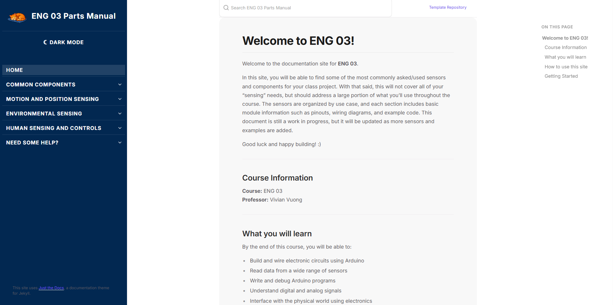

<h1 align="center">ENG 03 Arduino Documentation Site</h1>

<p align="center">
  <a href="https://blhuynh729.github.io"></a>
  
  
  
  
  
</p>

This repository contains the source code for the **ENG 03 Arduino Documentation Website**, a GitHub Pages site built to support UC Davis students learning electronics, sensors, and Arduino programming.

The site provides **step-by-step setup guides, sensor wiring diagrams, example Arduino code, and troubleshooting tips** in a clean, accessible format.

---

## Table of Contents

- [Live Site](#live-site)
- [What This Site Includes](#what-this-site-includes)
- [Design & UX Highlights](#design--ux-highlights)
- [Built With](#built-with)
- [Repository Structure](#repository-structure)
- [Editing Content](#editing-content)
- [Local Development (Optional)](#local-development-optional)
- [Contributing](#contributing)
- [Credits & Maintainers](#credits--maintainers)
- [Licensing and Attribution](#licensing-and-attribution)

---

## Live Site

Once GitHub Pages is enabled, the site is available at: https://blhuynh729.github.io

## What This Site Includes

- **Getting Started**
  - Arduino IDE installation
  - Board and port selection
  - Breadboard basics
  - Serial Monitor & debugging

- **Common Components**
  - DC Motors, Stepper Motors, Servo Motors
  - LCD Displays
  - Relays

- **Environmental Sensing**
  - Atmosphere (DHT11 Temp/Humidity, TMP36, Gas Sensors, Dust)
  - Liquid and Soil (Rain, Soil Moisture, Water Level, Flow, TDS, Submersible Temp)
  - Optical (Photoresistor, UV, RGB Color)
  - Acoustic (Microphone Amplifier)

- **Motion and Position Sensing**
  - Motion Detection (PIR, Vibration)
  - Orientation and Navigation (Accelerometer/Compass/Gyroscope, Tilt)
  - Proximity and Presence (Ultrasonic, Force)

- **Human Sensing and Controls**
  - Inputs (Push Button, Rotary Encoder, Keypad)
  - Biometrics (Heart Rate, Oximeter)

- **Each sensor page includes**
  - Description and use cases
  - Pinout tables and diagrams
  - Wiring instructions
  - Example Arduino code

- **Troubleshooting**
  - Upload errors
  - Power issues
  - Floating inputs
  - Serial output problems

- **Reference**
  - Pinout cheat sheets
  - Digital vs analog
  - I2C / SPI / UART basics
  - Pull-up resistors

## Design & UX Highlights


  <p align="center"></p>


- UC Davis branding (Aggie Blue & Gold)
- Wide, readable content layout
- Textured paper-style background for readability
- Mac Terminal–style code blocks with language labels
- Clear left navigation with active-page highlighting
- Responsive and mobile-friendly

## Built With

- **Jekyll**
- **Just the Docs** theme
- **GitHub Pages**
- Custom CSS for layout, navigation, and code styling

No backend or database required — this is a fully static site.

## Repository Structure

```
blhuynh729.github.io/
├── _config.yml              # Jekyll site configuration
├── _includes/               # Reusable Jekyll partials (figure.html, etc.)
├── assets/
│   ├── css/                 # Theme, nav, and dark-mode styles
│   ├── js/                  # Dark-mode toggle and site scripts
│   └── images/              # Sensor photos, pinouts, wiring diagrams
├── docs/
│   ├── Setup/               # Arduino IDE install, board/port, debugging
│   ├── Common_Parts/        # DC/stepper/servo motors, LCD, relays
│   └── sensors/
│       ├── Environmental-Sensing/
│       │   ├── Atmosphere/          # Temp, humidity, gas, dust
│       │   ├── Liquid-and-Soil/     # Rain, soil moisture, flow, TDS, etc.
│       │   ├── Optical/             # Photoresistor, UV, RGB
│       │   └── Acoustic/            # Microphone amplifier
│       ├── Motion-and-position-sensing/
│       │   ├── Motion-Detection/        # PIR, vibration
│       │   ├── Orientation-and-Navigation/  # Accelerometer, tilt
│       │   └── Proximity-and-Presence/      # Ultrasonic, force
│       └── Human-Sensing-and-Controls/
│           ├── Inputs/              # Push button, rotary encoder, keypad
│           └── Biometrics/          # Heart rate, oximeter
├── ENG 003 Parts Manual.md  # Source manual content is pulled from
├── CONTRIBUTING.md
├── LICENSE
└── index.md                 # Site landing page
```

## Editing Content

To add or edit pages:

1. Navigate to the `docs/` folder
2. Create or edit `.md` files
3. Commit changes
4. GitHub Pages rebuilds automatically

No local build is required for small edits.

## Local Development (Optional)

If you want to preview locally:

```bash
bundle install
bundle exec jekyll serve
```

Then open `http://127.0.0.1:4000` in your browser.

## Contributing

Contributions are welcome — typo fixes, clearer wiring descriptions, or whole new sensor pages. See [`CONTRIBUTING.md`](CONTRIBUTING.md) for the project structure and a step-by-step guide to adding content.

Quick ways to help:

- **Suggest a sensor page:** [open an issue](../../issues/new) describing the sensor and any datasheet links.
- **Fix something:** edit the relevant `.md` under `docs/` and open a pull request.
- **Report a bug:** broken link, missing image, or rendering issue? File an issue with the page URL.

## Credits & Maintainers

Built and maintained for **ENG 03 Introduction to Engineering Design**.

- Maintainer: [@blhuynh729](https://github.com/blhuynh729)
- Content adapted from the ENG 003 Parts Manual and contributors to this repository.

---

## Licensing and Attribution

This repository is licensed under the [MIT License]. You are generally free to reuse or extend upon this code as you see fit; just include the original copy of the license (which is preserved when you "make a template"). While it's not necessary, we'd love to hear from you if you do use this template, and how we can improve it for future use!

The deployment GitHub Actions workflow is heavily based on GitHub's mixed-party [starter workflows]. A copy of their MIT License is available in [actions/starter-workflows].

[Jekyll]: https://jekyllrb.com
[Just the Docs]: https://just-the-docs.github.io/just-the-docs/
[GitHub Pages]: https://docs.github.com/en/pages
[GitHub Pages / Actions workflow]: https://github.blog/changelog/2022-07-27-github-pages-custom-github-actions-workflows-beta/
[Bundler]: https://bundler.io
[use this template]: https://github.com/just-the-docs/just-the-docs-template/generate
[`jekyll-default-layout`]: https://github.com/benbalter/jekyll-default-layout
[`jekyll-seo-tag`]: https://jekyll.github.io/jekyll-seo-tag
[MIT License]: https://en.wikipedia.org/wiki/MIT_License
[starter workflows]: https://github.com/actions/starter-workflows/blob/main/pages/jekyll.yml
[actions/starter-workflows]: https://github.com/actions/starter-workflows/blob/main/LICENSE
